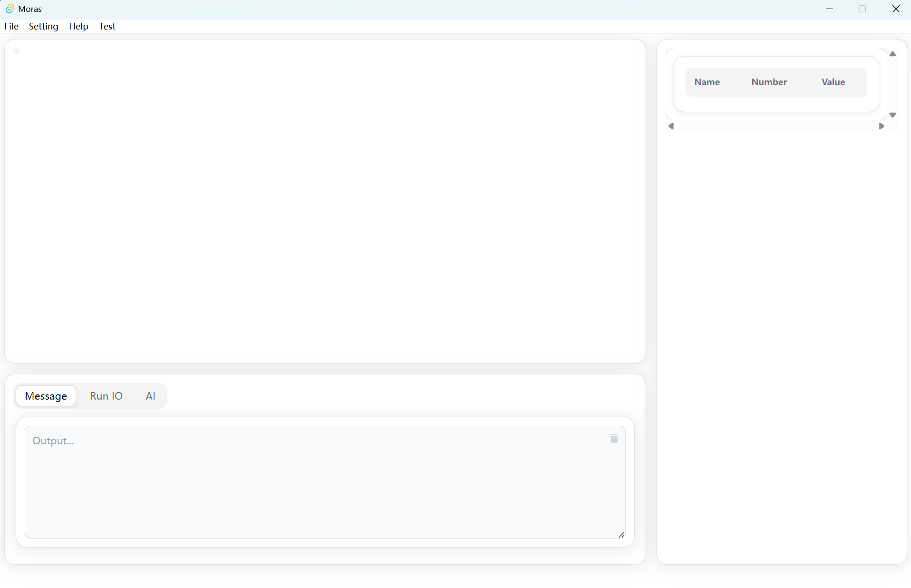
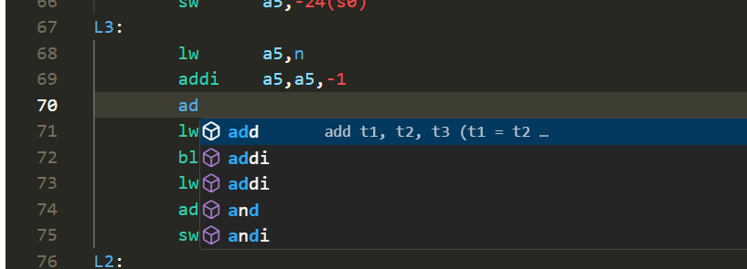
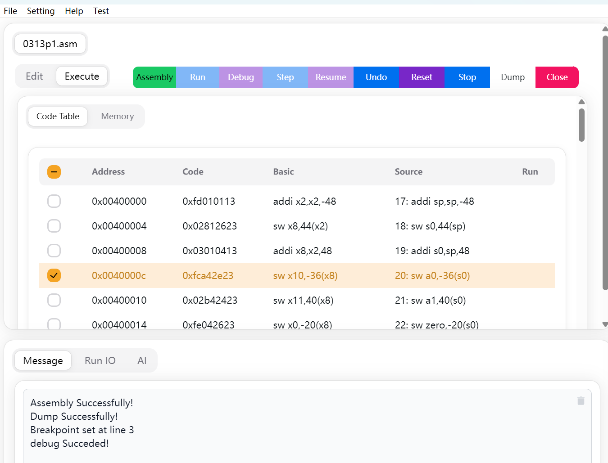

# Features

> Dive into the extensive features that make Moras stand out. Learn about the user-friendly interface, AI-enhanced 
> capabilities, and more. This section highlights each feature and how it can elevate your coding experience.

## User Interface

**Simplicity Meets Power**:

Our IDE boasts a clean and intuitive user interface that simplifies your workflow. With a focus on usability, the interface is structured to provide quick access to all essential tools without overwhelming you. From the customizable toolbar to the responsive design, every aspect of the user interface is crafted to make your coding sessions more productive and enjoyable.

## Code Completion

**Intelligent Assistance at Your Fingertips**:

Code completion is not just about saving time; it's about learning and improving your coding skills. Our IDE's intelligent code completion suggests functions, variables, and snippets as you type, helping you write code faster and with fewer errors. It's like having a knowledgeable companion guiding you through the coding process, enhancing your learning curve.

## Debugging

**Robust Tools for Flawless Code**: 

Debugging can be a daunting task, but not with MORAS. Our comprehensive debugging tools allow you to easily set breakpoints, step through your code, and inspect variables. The real-time error detection and tips ensure that you can identify and fix issues promptly, leading to a more robust and error-free codebase.

## Collaboration

**Collaborate and Learn Together**: 

Collaboration is key in learning and problem-solving. MORAS supports multi-user simultaneous editing, enabling you to work with peers in real-time. Share your projects, pair program, and get instant feedback, all within the IDE. This feature fosters a collaborative environment where knowledge is shared, and learning is a collective experience.