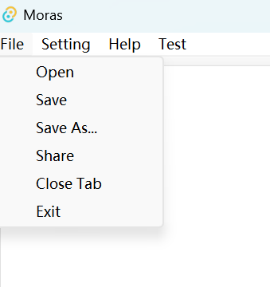

# Get Started

> Embark on your coding journey with Moras. This section provides all the necessary information to get you set up and 
> ready. From installation to creating your first project, we’ll guide you through each step to ensure a smooth start.

## 💿Installation

**Step 1: Download the Installer**
Begin by downloading the latest version of Moras from our official website or GitHub repository. Look for the file named `moras_v0.2.0.exe` for Windows `moras_v0.2.0.dmg` for macOS.

**Step 2: Run the Installer**
Once the download is complete, locate the file in your Downloads folder and double-click to run the installer. Follow the on-screen instructions to proceed with the installation.

**Step 3: Accept the License Agreement**
Read through the license agreement carefully. If you agree to the terms, select 'I Agree' to continue with the installation.

**Step 4: Choose Installation Location**
Select the destination folder where you want Moras to be installed. The default location is usually recommended for most users.

**Step 5: Complete the Installation**
After selecting the installation location, click 'Install' to begin the process. A progress bar will indicate the installation status. Once completed, click 'Finish' to exit the installer.

## 🔧Setup

**Step 1:** Launch Moras Find the Moras icon on your desktop or in your applications folder and double-click to open the IDE.

**Step 2:** Open a Project To start coding.

<div align="middle"> </div>

You can either create a new project or open an existing one. Use the ‘File’ menu to navigate these options.

**Step 3:** Explore the Interface.

<div align="middle"> </div>

Take a moment to familiarize yourself with the layout of Moras. Notice the toolbar, editor window, and sidebar.

With MORAS installed and set up, you’re now ready to begin your coding adventure. Should you encounter any issues, refer to the help document for assistance.

## 👋First Project —— Creating "*Hello Moras!*"

The most basic code that could be made in C is something like:

```
int main(){
    puts("Hello Moras!\n");
    return 0;
}
```
We don't have access to the C standard library though so lets turn puts into a call to `write(fd,buffer,len)` which 
directly maps to a Linux system call. And let's also lift the definition of the string into a global variable because 
assembly language doesn't allow strings as arguments.

This leaves us with some directly translatable C code:

```
char* str = "Hello Moras!\n"
int main(){
    write(1,str,13);
    return 0;
}
```

The first line can be translated into assembly as:
```
.data # Tell the assembler we are defining data not code
str:  # Label this position in memory so it can be referred to in our code 
.string "Hello Moras!\n" # Copy the string "Hello Moras!\n" into memory 
```

To start defining the main function we will use the code:

```
.text # Tell the assembler that we are writing code (text) now 
main: # Make a label to say where our program should start from
```

The body of main is a little harder to directly translate because you have to set up each of the arguments to the system
call one by one. In total `write(1,str,13)` will take 5 instructions:

```
li a0, 1   # li means to Load Immediate and we want to load the value 1 into register a0
la a1, str # la is similar to li, but works for loading addresses
li a2, 13  # like the first line, but with 13. This is the final argument to the system call
li a7, 64  # a7 is what determines which system call we are calling and we what to call write (64)
ecall      # actually issue the call
```

`return 0` is going to need to be changed a little before we can translate it. To exit cleanly we will need to use the 
exit system call.

```
li a0, 0  # The exit code we will be returning is 0
li a7, 93 # Again we need to indicate what system call we are making and this time we are calling exit(93)
ecall 
```

Putting all of those snippets together we get the code:

```
.data # Tell the assembler we are defining data not code
str:  # Label this position in memory so it can be referred to in our code 
  .string "Hello Moras!\n" # Copy the string "Hello Moras!\n" into memory 

.text # Tell the assembler that we are writing code (text) now 
main: # Make a label to say where our program should start from

  li a0, 1   # li means to Load Immediate and we want to load the value 1 into register a0
  la a1, str # la is similar to li, but works for loading addresses
  li a2, 13  # like the first line, but with 13. This is the final argument to the system call
  li a7, 64  # a7 is what determines which system call we are calling and we what to call write (64)
  ecall      # actually issue the call

  li a0, 0   # The exit code we will be returning is 0
  li a7, 93  # Again we need to indicate what system call we are making and this time we are calling exit(93)
  ecall 
```