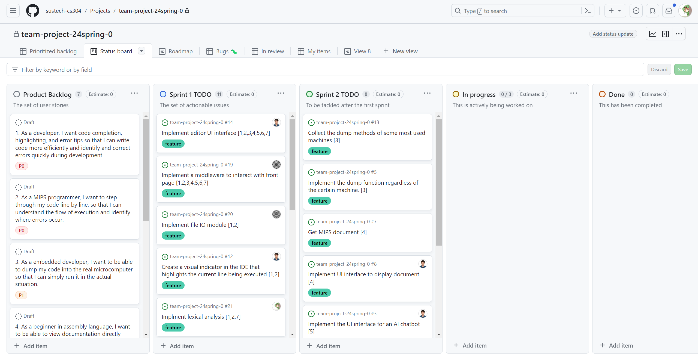
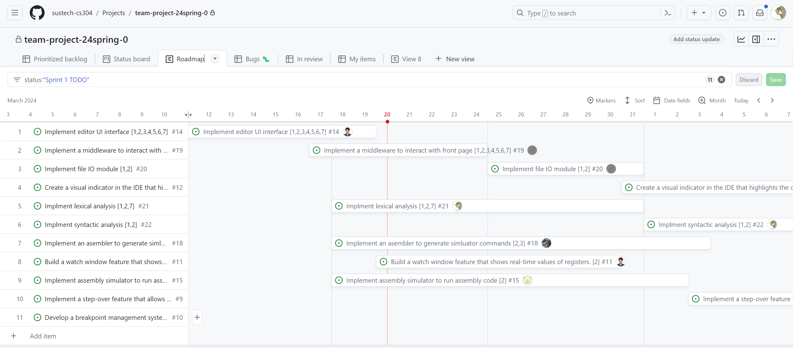

# Team Project - Proposal

**MORAS: An Intelligent RISC-V/MIPS IDE**

Group: 0

Member: 侯芳旻(12111448) 贾禹帆(12111224) 蒋钦杰(12111110) 刘宇涵(12111811) 欧阳安男(12211831)

## Part I. Project Proposal

### Project Overview

Our goal is to **provide a convenient and user-friendly IDE** for **students learning computer organization**. Our target users are those who are studying this subject, and we have developed a range of features to enhance their coding experience.

To achieve our goal of providing a convenient and user-friendly IDE for students learning computer organization, our IDE incorporates various functionalities. We **leverage AI's API** to enhance the capabilities of our system, offering advanced features and intelligent assistance. Additionally, our IDE supports **multi-user simultaneous editing**, encouraging collaboration and teamwork among students. It also provides **code completion, highlighting, and error tips** to assist students in writing code efficiently and accurately. For debugging purposes, **robust debug support** is available, enabling students to analyze variables and resolve issues or bugs. The **"dump" functionality** allows students to inspect memory and register values, enhancing their understanding of program execution. **Built-in documentation** offers quick access to relevant information and resources, while the **"replace same name label"** feature helps students manage and organize their code effectively. Overall, our IDE aims to create a comfortable and enriching coding experience for students studying computer organization.

Overall, our overall goal is to **create an IDE that simplifies the learning process for students studying computer organization**. By providing a user-friendly interface and a range of powerful features, we strive to offer students a comfortable and enriching coding experience.

### Preliminary Requirement Analysis

#### Functional Requirements

##### Using AI's API

As a assembly language programmer, I want to be able to directly ask questions about code to AI, so that I can complete programming tasks more quickly and accurately.

##### Multi-user Simultaneous Editing

As students for Computer Organziation cource, they need to write assembly code for their self-design cpu. So that to improve the efficent of debug and coding, multiple user simultaneous editing.

##### Code Completion, Highlighting, Error Tips

As a developer, I want code completion, highlighting, and error tips so that I can write code more efficiently and identify and correct errors quickly during development.

##### Debug Support

As a MIPS programmer, I want to step through my code line by line, so that I can understand the flow of execution and identify where errors occur.

##### Dump

As a embedded developer, I want to be able to dump my code into the real microcomputer so that I can simply run it in the actual situation.

##### Built-in Documentation

As a beginner in assembly language, I want to be able to view documentation directly within the editor, so that I can access the necessary knowledge without having to open a browser and disrupt my workflow.

##### Replace Same Name Label

As a picky coder, I want to do lable rename like IDE's symbol rename. So that I can reduce errors caused by misstake and improve my coding experience.

#### Non-functional Requirements

##### Usability

The usability of our IDE is a key consideration. We have designed it to be accessible and compatible with multiple platforms, including Windows, MacOS, and Linux. This allows students to use our IDE on their preferred operating system, providing flexibility and convenience.

##### Safety

Ensuring the safety of user code is of utmost importance to us. Our IDE has implemented strict security measures to prevent any leakage of user code to unauthorized individuals or external sources. We prioritize the privacy and confidentiality of our users' work, creating a secure environment for their coding projects.

##### Security

In addition to safeguarding user code, our IDE focuses on maintaining overall security. We have implemented measures to prevent memory leaks, ensuring that system resources are properly managed and utilized. By addressing potential security vulnerabilities, we strive to provide a secure coding environment for our users.

##### Performance

To enhance the performance of our IDE, we have optimized the execution of assembly code. Our IDE is designed to run assembly code quickly and efficiently, minimizing any delays or slowdowns during the execution process. By prioritizing performance, we aim to provide a smooth and seamless coding experience for our users.

#### Data Requirements

We need **assembly language documents** and **AI API keys** in this project. To get assembly language documents, we may use web pages from official assembly language documents. And we may apply for AI API keys directly on their official websites.

#### Technical Requirements

We will use **Tauri** to develop our application. The operating environment is desktop OS such as Windows, MacOS, and Linux. Tauri is a **multi-platform** desktop application framework with **Rust** as backend and **Javascript** as frontend.

## Part II. Task Decomposition & Planning

## Part III. AI Usage

### Have you used AI to propose features for the project?

No. We came up with these features in a brain storm.

  
ChatGPT4

  

The AI could generate most of our features for common usecase, but if couldn't generate more specific feature for SUSTech student.

### Have you used AI to conduct the preliminary requirement analysis (e.g., identify functional and nonfunctional requirements)?

Yes.  

    
ChatGPT

  
  
  
  

We used them to generate content about non-functional requirements, but we did not use AI to identify these requirements. Besides, we also use AI to help us write better language.

### Have you used AI to generate user stories?

No. We write it by ourselves.  

  
Ernie Bot

  

Compared the user stories generated by Ernie Bot with our manual answers. The user story generated by AI captures the essence of these requirements, demonstrating that the AI model can understand and synthesize the needs of students learning computer organization. However, the user stories provided by a real person offer a more personalized and specific perspective, reflecting the needs and preferences of someone with direct experience in the field.

The manual answer is better because it offers more personalized and specific perspective, by I think AI do can assist the requirement analysis.

### Have you used AI to generate issues or tasks?

No, we didn't use AI.  

  
Tongyi Qianwen

  

We asked Tongyi Qianwen for comparison. We think it's barely satisfying but too basic compared to our manual answers. It lists the fundamental issues and tasks but lacks innovative and practical functions.

