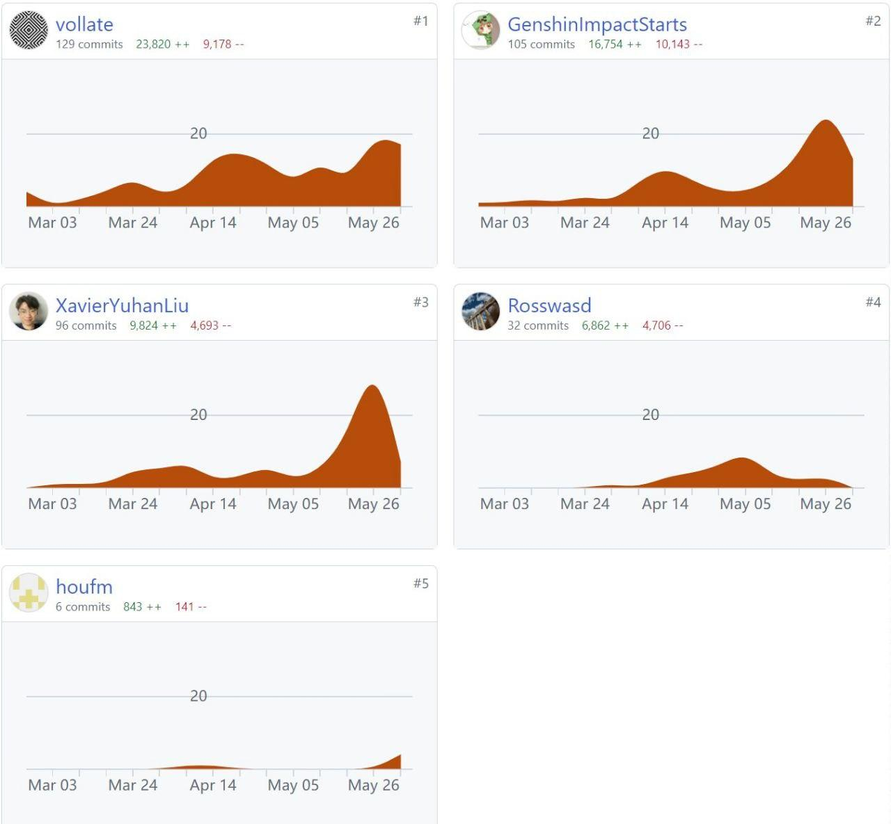

# Moras - Sprint2

## 1. Metrics

We use a script to statics our project, which have a Rust backend with a NextJS frontend. The script could be found at here: [statics.sh](../../scripts/stastics.sh)

```text
# Output
Counting lines of code...
Counting number of packages...
Counting number of source files...
Counting number of dependencies...
-------------------------------------------------------------------------------------------------------------------------------------------------
Lines of Code:
===============================================================================
 Language            Files        Lines         Code     Comments       Blanks
===============================================================================
 Assembly                1          149          148            0            1
 CSS                     1           33           20            9            4
 JavaScript              9          422          365           30           27
 JSON                    5         8550         8550            0            0
 JSX                    11         1782         1618           56          108
 Protocol Buffers        1           75           61            0           14
 Shell                   2           56           35           10           11
 SVG                     3            9            8            1            0
 TOML                    3           48           40            4            4
-------------------------------------------------------------------------------
 HTML                    1           14           14            0            0
 |- CSS                  1           22           22            0            0
 (Total)                             36           36            0            0
-------------------------------------------------------------------------------
 Markdown                5          389            0          261          128
 |- BASH                 1            7            4            3            0
 (Total)                            396            4          264          128
-------------------------------------------------------------------------------
 Rust                   90        11460        10396          211          853
 |- Markdown            10          306            0          263           43
 (Total)                          11766        10396          474          896
===============================================================================
 Total                 132        22987        21255          582         1150
===============================================================================
-------------------------------------------------------------------------------------------------------------------------------------------------
Number of Packages: 2
-------------------------------------------------------------------------------------------------------------------------------------------------
Number of Source Files: 118
-------------------------------------------------------------------------------------------------------------------------------------------------
Number of Dependencies: 18
-------------------------------------------------------------------------------------------------------------------------------------------------

```

## 2. Documentation

### Documentation for End Users

Our project includes comprehensive documentation for end users, which provides essential information and step-by-step instructions on how to use the software. This documentation is designed to be a user manual, helping end users to navigate and utilize the features of our application effectively. You can find the user documentation [here](https://rosswasd.github.io/team-project-24spring-0/).

### Documentation for Developers

To assist developers, collaborators, and potential future contributors, we have created detailed API documentation. This documentation is intended to explain the design, purpose, and implementation of important code entities, such as classes and methods, enabling developers to update or extend our software with ease. The backend developer documentation, generated by Rust's `rustdoc`, can be accessed [here](https://sustech-cs304.github.io/team-project-24spring-0/moras/). This documentation provides clear explanations of the main APIs that both frontend and backend developers may use.

By maintaining thorough and up-to-date documentation for both end users and developers, we ensure that our software is easy to use and maintain. And our doc is generate

## 3. Tests

Since we use Rust as our main language, we can easily write tests in our code with the `#[test]` attribute. We have written 29 unit tests in total, covering major functions of the backend logic. However, since our backend and frontend are separated, writing tests for frontend logic is challenging, so the part that communicates with the frontend is not tested.

We generate our test report with the command `cargo tarpaulin --out html`. (need to install `cargo-tarpaulin` first.) This command generates the coverage report. We also use GitHub CI to run tests, generate the coverage report, and deploy the test result to our GitHub Pages automatically. You can check it [here](https://sustech-cs304.github.io/team-project-24spring-0/report#src). We achieved a 63.85% coverage rate for our backend code.

## 4. Build

Our project leverages a highly automated and robust build process to streamline the compilation of source code, the assembly of dependencies, and the production of executables. We have integrated several tools and frameworks to achieve this seamless automation.

### Tools and Frameworks Utilized

To manage our build process, we rely on a combination of `cargo` for Rust, `npm` for JavaScript dependencies, and GitHub CI/CD for continuous integration and deployment. Additionally, we use the `tauri` framework to build cross-platform applications, further enhancing our development workflow.

### Build Process Tasks

Our build process encompasses both continuous integration (CI) and continuous deployment (CD) tasks, ensuring that our codebase is always in a deployable state.

**Continuous Integration (CI)**

The CI process is meticulously defined in our [build.yaml](../../.github/workflows/build.yml) configuration. It begins with a format check to ensure code consistency and adherence to styling guidelines. This is accomplished using `cargo fmt -- --check` for Rust code and `npm run format-check` for JavaScript files. Maintaining consistent code style is crucial for collaboration and code readability.

Next, we generate a comprehensive test coverage report using the script [report.sh](../../scripts/report.sh), which runs `cargo tarpaulin --out Html` to create detailed coverage metrics. This helps us identify untested parts of our code and improve overall test coverage.

We then execute all unit tests with `cargo test`, ensuring that our backend logic functions as intended. This step is vital for catching any regressions or bugs early in the development cycle.

To further enhance our documentation, we generate it alongside the test reports using `cargo doc --no-deps`. This provides up-to-date and accurate documentation for our codebase, which is essential for both current and future developers working on the project.

Finally, our CI pipeline automatically deploys the generated documentation and test reports to GitHub Pages, making them easily accessible for review. This seamless integration with GitHub CI/CD highlights the high level of automation in our build process, significantly reducing manual intervention and errors.

**Continuous Deployment (CD)**

Our CD process, defined in [release.yaml](../../.github/workflows/release.yml), focuses on building our application for multiple platforms. Utilizing the `tauri-apps/tauri-action@v0` action, we run `cargo tauri build` to compile the application. This ensures that our build artifacts are consistent and reliable across different operating systems.

The final step in our CD pipeline is the deployment of the executable to GitHub. This automated deployment ensures that our latest application version is always available for download on our [releases page](https://github.com/sustech-cs304/team-project-24spring-0/releases).

### Build Files and Configuration

Our build process is defined and managed through several configuration files:

- The backend configuration is specified in the [Cargo.toml](../../src-tauri/Cargo.toml) file, detailing dependencies and build scripts for the Rust project.
- The frontend dependencies and build commands are defined in the [package.json](../../src-ui/package.json) file.
- The CI and CD workflows are meticulously outlined in the [build.yaml](../../.github/workflows/build.yml) and [release.yaml](../../.github/workflows/release.yml) files respectively.

These configurations collectively ensure a smooth and automated build process, reflecting our commitment to maintaining a high level of automation and efficiency in our development workflow.

## 5. Deployment

This is a desktop application without any server provided online services, so there is no need for deployment it to container(docker also not support to run GUI application without tricks like X11-forwording or virtual desktop). However, since our application is a cross-paltform application, we can build it for multiple platforms and release it to GitHub with github actions.

We use Tauri to build our application, which can build our application for Windows, macOS, and Linux. Moreove, we use GitHub CD to automatically build our application for multiple platforms easily. Our github release action is heree [release.yaml](../../.github/workflows/release.yml), it could do multi-platforms builds and push the artifacts to a draft release without any maunally operation. This workflow is trriger by tag operation, once we push a teg like "v1.0.0", it will release our v1.0.0 version's applications.

And application releases can be found [here](https://github.com/sustech-cs304/team-project-24spring-0/releases).

## 6. Collaborations And AI Usages



AI useage: To faster our develop, we us AI to generate some of our unit test cases. All test cases generate by has a comment.

